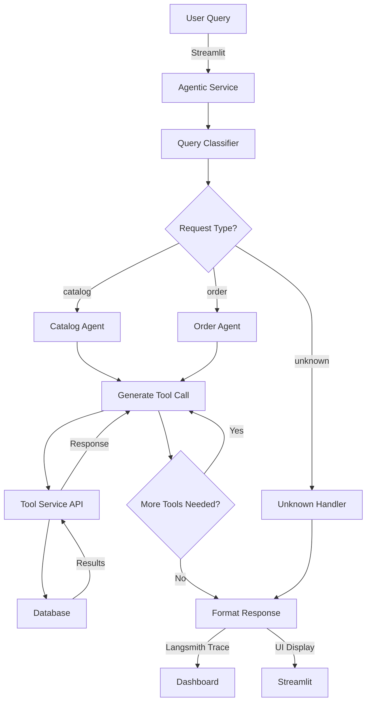

# E-Commerce Agentic Assistant

A production-ready e-commerce assistant powered by **Agentic AI** with intelligent tool calling, the **ReAct agent pattern**, and comprehensive observability via **Langsmith**. This project demonstrates how to build autonomous agents that make decisions and access external tools through a structured API service.

---

## 🎯 What I Learned & Applied

### **1. Agentic AI & Autonomous Decision Making**

**Key Concepts:**
- **Agent Autonomy**: Agents make decisions independently by reasoning about user queries and deciding what tools to use
- **Iterative Reasoning**: The ReAct pattern (Reasoning + Acting) enables agents to think through problems step-by-step
- **State Management**: Agents maintain state throughout execution, allowing them to track context and iterate

**Implementation:**
- Built a **query classifier** that routes requests to appropriate agents before tool invocation
- Implemented specialized agents for **catalog** and **order** domains
- Each agent reasons about the user query and independently decides which tools to invoke

```
User Query → Router → Catalog Agent / Order Agent → Tool Invocation → Response
```

---

### **2. Tool Calling & ReAct Agent Pattern**

**Key Concepts:**
- **Tool Calling**: Agents declare intentions to use tools through structured outputs, enabling deterministic tool invocation
- **ReAct Loop**: Agents cycle through Reasoning (planning) and Acting (tool invocation)
- **Structured Decision Making**: Using Pydantic models (`ToolCall`, `AgentDecision`) ensures agents output valid, parseable decisions

**Implementation:**

```python
class ToolCall(BaseModel):
    name: str  # Tool name
    args: Dict[str, Any]  # Tool arguments

class AgentDecision(BaseModel):
    agent_response: str  # What the agent is thinking
    tool_call: Optional[ToolCall]  # What tool to invoke next
```

**ReAct Flow:**
1. **Reasoning**: LLM analyzes the query and decides if a tool is needed
2. **Acting**: If `tool_call` is set, the agent invokes the tool with specified arguments
3. **Observing**: Results are fed back to the agent for further reasoning
4. **Completion**: When `tool_call` is None, the agent returns the final response

---

### **3. API Service Architecture & Tool Integration**

**Key Concepts:**
- **Separation of Concerns**: Agents (agentic_service) are decoupled from data operations (tool_service)
- **HTTP as a Tool Interface**: Tools are exposed via REST API, making them language/framework agnostic
- **Request/Response Contracts**: Standardized schemas ensure reliable tool communication

**Architecture:**

```
┌─────────────────────────────────┐
│   Streamlit UI / Notebook       │
│   (User Interface)              │
└──────────────┬──────────────────┘
               │
┌──────────────▼──────────────────┐
│   Agentic Service               │
│   ├─ Query Classifier          │
│   ├─ Catalog Agent             │
│   ├─ Order Agent               │
│   └─ ReAct Loop Engine         │
└──────────────┬──────────────────┘
               │ HTTP Calls
┌──────────────▼──────────────────┐
│   Tool Service (FastAPI)        │
│   ├─ /products/search          │
│   ├─ /products/categories      │
│   ├─ /orders/customer          │
│   └─ /users/search             │
└──────────────┬──────────────────┘
               │
       ┌───────▼────────┐
       │   Database     │
       │   Models       │
       └────────────────┘
```

**Service Implementation:**
- **Tool Service**: FastAPI backend with routes for products, orders, and users
- **Service Clients**: Each agent has a service client (CatalogService, OrderService) that handles HTTP communication
- **Response Standardization**: All API responses follow a consistent pagination + data structure

---

### **4. Langsmith Integration for Observability**

**Key Concepts:**
- **Distributed Tracing**: Track agent decisions and tool calls through the entire pipeline
- **Experiment Tracking**: Compare agent behavior across different model configurations
- **Debugging**: Replay traces to understand why agents made specific decisions
- **Production Monitoring**: Monitor agent performance and detect issues in real-time

**Implementation:**
- `@traceable` decorators on critical functions: `categorize_query()`, `router_node()`, `catalog_agent_node()`, etc.
- Automatic logging of:
  - Query classification results
  - Tool invocations and responses
  - Agent reasoning steps
  - Final responses

**Usage:**
```python
from langsmith import traceable

@traceable
def categorize_query(state: Dict[str, Any]) -> Dict[str, Any]:
    chain = build_intent_chain()
    result = chain.invoke({"user_query": state["user_query"]})
    return {"request_type": result.request_type, ...}
```

All traces automatically flow to Langsmith dashboard for analysis.

---

## 📊 Agent Architecture

### **Query Classification Node**
Routes user queries to the appropriate handler:
- **Catalog**: Product search, browsing, recommendations
- **Order**: Order tracking, status, returns, refunds
- **Unknown**: General questions or out-of-domain requests

```
CLASSIFICATION_PROMPT: 
"You are a STRICT routing engine for an ecommerce assistant..."
```

### **Catalog Agent Node**
Searches and filters products using the tool_service API:

**Tools:**
- `fetch_categories()`: Get available product categories
- `search_products()`: Search products by name, category, brand, price, rating

**ReAct Cycle:**
1. Parse user query for product filters
2. Call tool: `search_products(product_name, category, brand, ...)`
3. If results empty, retry with reduced parameters
4. Format and return results

### **Order Agent Node**
Retrieves and filters customer orders:

**Tools:**
- `search_orders()`: Query orders with filters

**ReAct Cycle:**
1. Ensure customer_id is available in context
2. Extract order filters from user query
3. Call tool: `search_orders(customer_id, status, date_range, ...)`
4. Format and return order information

---

## 🏗️ Project Structure

```
ecom_assistant/
├── agentic_service/           # Agent orchestration & LLM logic
│   ├── agents/
│   │   ├── common.py          # Shared types (AgentState, ToolCall)
│   │   ├── query_classification/
│   │   │   └── classifier.py  # Intent routing
│   │   ├── catalog_agent/
│   │   │   ├── service.py     # HTTP client for tool_service
│   │   │   └── tools.py       # Tool definitions
│   │   └── order_agent/
│   │       ├── service.py     # HTTP client for tool_service
│   │       └── tools.py       # Tool definitions
│   ├── configs/
│   │   ├── agents.py          # Agent system prompts & models
│   │   └── configs.py         # Environment configuration
│   ├── ecom_agent/
│   │   └── __init__.py        # LangGraph workflow definition
│   ├── streamlit_app.py       # Interactive UI
│   └── ecom_agent.ipynb       # Notebook for experimentation
│
├── tool_service/              # Backend API providing tools
│   ├── main.py                # FastAPI app setup
│   ├── database.py            # SQLAlchemy connection
│   ├── models.py              # ORM models
│   ├── schemas.py             # Request/response schemas
│   └── routers/
│       ├── products.py        # /products endpoints
│       ├── orders.py          # /orders endpoints
│       └── users.py           # /users endpoints
│
└── requirements.txt           # All dependencies
```

---

## 🚀 Key Technologies

| Component | Technology | Purpose |
|-----------|-----------|---------|
| **LLM Framework** | LangChain + LangGraph | Building chains and agentic workflows |
| **Agent Orchestration** | LangGraph | StateGraph for ReAct loop management |
| **LLM Models** | Ollama + Google GenAI | Local and cloud LLM inference |
| **Tool Service** | FastAPI | HTTP API for tool invocation |
| **Observability** | Langsmith | Trace and monitor agent decisions |
| **UI** | Streamlit | Interactive chat interface |
| **Database** | SQLAlchemy + SQLite | Persistent data storage |

---

## 💡 Learning Highlights

### **Agentic AI**
- ✅ Agents operate autonomously with reasoning capabilities
- ✅ Decisions are deterministic (structured outputs via Pydantic)
- ✅ State management enables multi-step reasoning
- ✅ Tool integration is abstracted via HTTP APIs

### **Tool Calling**
- ✅ Tools are declared as structured ToolCall objects
- ✅ LLM generates tool invocations, not direct code execution
- ✅ Service clients handle tool communication over HTTP
- ✅ Response contracts are standardized for consistency

### **ReAct Pattern**
- ✅ Agents reason (plan what tool to use) before acting (invoking it)
- ✅ Results flow back for observation, enabling iterative refinement
- ✅ Iteration limits prevent infinite loops
- ✅ Final response is generated when no more tool calls are needed

### **API Services**
- ✅ Tools decoupled from agent logic via REST API
- ✅ Stateless service design enables horizontal scaling
- ✅ Request validation via Pydantic schemas
- ✅ Consistent pagination and response structure

### **Langsmith**
- ✅ `@traceable` decorators capture function execution
- ✅ Traces include inputs, outputs, and execution time
- ✅ Tool calls are automatically logged with parameters and results
- ✅ Full visibility into agent reasoning and decisions

---

## 🛠️ Configuration

### Environment Variables

```bash
# Agent Models
ECOM_CLASSIFIER_MODEL=llama3.2:3b                    # Classification LLM
ECOM_CATALOG_AGENT_MODEL=gemma4:31b-cloud           # Catalog reasoning LLM
ECOM_ORDER_AGENT_MODEL=gemma4:31b-cloud             # Order reasoning LLM
ECOM_LLM_TEMPERATURE=0                              # Deterministic output

# Services
ECOM_TOOLS_API_URL=http://127.0.0.1:8000            # Tool service URL
HTTP_REQUEST_TIMEOUT=30                              # HTTP timeout

# Langsmith
LANGCHAIN_TRACING_V2=true                           # Enable tracing
LANGCHAIN_API_KEY=<your-api-key>                   # Langsmith API key
LANGCHAIN_PROJECT=ecom_assistant                    # Project name

# Logging
LOG_LEVEL=INFO
LOG_FORMAT=%(asctime)s | %(levelname)-8s | %(message)s
```

---

## 📝 Running the Application

### 1. Install Dependencies
```bash
pip install -r requirements.txt
```

### 2. Start Tool Service
```bash
cd tool_service
uvicorn main:app --reload --port 8000
```

### 3. Start Streamlit UI
```bash
cd agentic_service
streamlit run streamlit_app.py
```

### 4. (Optional) Use Jupyter Notebook
```bash
cd agentic_service
jupyter notebook ecom_agent.ipynb
```

---

## 📖 Example Usage

### Catalog Query
```
User: "Show me affordable running shoes under $100"

Classification: "catalog"
Agent: Extracts filters (product_name="running shoes", max_price=100)
Tool Call: search_products(product_name="running shoes", max_price=100)
Response: [list of products matching criteria]
```

### Order Query
```
User: "What's the status of my recent orders?"

Classification: "order"
Agent: Uses customer_id from context
Tool Call: search_orders(customer_id="user123", limit=10)
Response: [list of orders with status and tracking info]
```

### Out-of-Domain Query
```
User: "What's the weather like?"

Classification: "unknown"
Response: "Sorry, I couldn't understand your request."
```

---

## 🔍 Observability with Langsmith

View traces in Langsmith dashboard:

1. **Query Classification Trace**: See how queries are routed
2. **Agent Execution Trace**: Observe reasoning steps and tool calls
3. **Tool Invocation Trace**: Track API calls and responses
4. **Performance Metrics**: Latency and token usage for each component

```python
# Example trace structure
Query Classification
├─ categorize_query
│  ├─ Input: user_query
│  ├─ LLM Invocation
│  └─ Output: request_type
│
└─ router_node
   ├─ Input: state
   └─ Output: updated state with request_type
```

---

## 📚 Key Concepts Implemented

| Concept | Implementation |
|---------|-----------------|
| **Agent State** | TypedDict with tool_call_count, agent_response, response_data |
| **Tool Calling** | ToolCall Pydantic model with name and args |
| **ReAct Loop** | Conditional logic checking if tool_call is None |
| **Tool Integration** | HTTP service clients (CatalogService, OrderService) |
| **Routing** | Query classifier routes to specialized agents |
| **Error Handling** | is_error flag, empty_tool_result() fallbacks |
| **Observability** | @traceable decorators, Langsmith integration |

---

## 🎓 What This Project Teaches

This project is a complete reference implementation for:

1. **Building Agentic Systems**: Autonomous agents with reasoning and tool-calling capabilities
2. **Tool Calling Pattern**: Structured outputs for deterministic tool invocation
3. **ReAct Agents**: Reason → Act → Observe → Repeat pattern implementation
4. **Microservices Architecture**: Decoupling agent logic from tool services
5. **LangGraph Workflows**: Building complex agent orchestrations with conditional routing
6. **Production Observability**: End-to-end tracing with Langsmith
7. **API Design**: Creating clean, scalable tool service interfaces

---

## 📦 Dependencies Highlights

- **langchain**: Framework for LLM applications
- **langgraph**: State machines for agentic workflows
- **langsmith**: Production monitoring and tracing
- **fastapi**: High-performance API service
- **streamlit**: Interactive UI for agent testing
- **ollama**: Local LLM serving
- **google-genai**: Cloud LLM access

---

## 🔄 Agent Decision Flow



---

## ✨ Future Enhancements

- [ ] Multi-turn conversations with memory
- [ ] Tool result verification and validation
- [ ] Human-in-the-loop for high-risk decisions
- [ ] Cost optimization for LLM calls
- [ ] Parallel tool execution
- [ ] A/B testing different agent prompts via Langsmith experiments

---

## 📄 License

Open source - feel free to use and extend!

---

**Built with 🤖 Agentic AI patterns and observability best practices**
